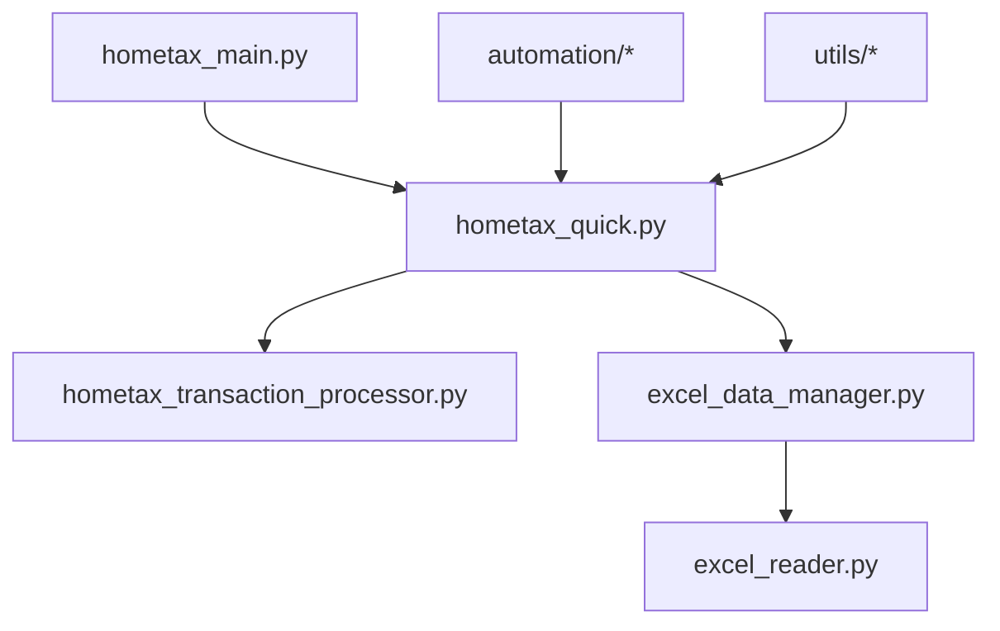

# 🏛️ 홈택스 세금계산서 자동화 시스템 v2.0

> 한국 홈택스 시스템의 세금계산서 작성을 완전 자동화하는 Python 솔루션


---

## 🚀 Quick Start

```bash
# 1. 프로젝트 클론
cd C:\APP\tax-bill

# 2. 의존성 설치
pip install -r requirements.txt
playwright install chromium

# 3. 환경 설정
echo PW=your_certificate_password > .env

# 4. 메인 애플리케이션 실행
python core/hometax_main.py
```

---

## 📁 프로젝트 구조

```
tax-bill/
├── 🏗️  core/                   # 핵심 시스템
├── 🤖  automation/              # 자동화 모듈  
├── 🛠️  utils/                   # 유틸리티
├── 🧪  tests/                   # 테스트 스위트
├── 🚀  deployment/              # 배포 도구
├── 📚  docs/                    # 문서
├── 📋  requirements.txt         # 의존성
├── ⚙️  .env                     # 설정 파일
└── 📖  CLAUDE.md               # AI 개발 가이드
```

---

## 🎯 주요 기능

### ✨ 핵심 자동화
- **🔐 홈택스 인증서 로그인**: Playwright 기반 안정적 인증
- **📊 엑셀 데이터 처리**: 대용량 거래 데이터 자동 처리
- **🧾 세금계산서 자동 작성**: 16건 이하 완전 자동화
- **💰 금액 검증**: 실시간 합계 검증 및 불일치 알림

### 🔧 고급 기능  
- **📅 공급일자 자동 조정**: 년월 비교 후 자동 변경 (5회 beep)
- **🎵 사용자 알림**: 금액 불일치 시 연속 beep + 대화상자
- **🧹 자동 필드 초기화**: 다음 작업을 위한 폼 리셋
- **📝 결과 기록**: 엑셀 시트에 자동 기록

---

## 🏗️ 시스템 아키텍처

### 모듈 의존성 관계


### 데이터 플로우
1. **📥 Data Input**: 엑셀 파일 읽기
2. **🔄 Processing**: 거래처별 그룹핑 및 검증  
3. **🌐 Web Automation**: 홈택스 폼 자동 입력
4. **✅ Validation**: 금액 검증 및 사용자 확인
5. **💾 Output**: 결과 기록 및 완료 알림

---

## 🔧 기술 스택

| 카테고리 | 기술 | 목적 |
|---------|------|------|
| **Core** | Python 3.8+ | 메인 언어 |
| **Web Automation** | Playwright | 홈택스 자동화 (권장) |
| **Legacy Support** | Selenium | 레거시 지원 |
| **Data Processing** | pandas, openpyxl, xlwings | 엑셀 처리 |
| **UI** | tkinter, ttkbootstrap | 사용자 인터페이스 |
| **Deployment** | PyInstaller, NSIS | 배포 패키징 |

---

## 📊 개발 진행 상황

### ✅ 완료 (100%)
- ✅ 홈택스 로그인 자동화
- ✅ 세금계산서 자동 작성 엔진
- ✅ 거래내역 상세 처리 (12개 함수)
- ✅ 토큰 효율성 최적화 (모듈 분할)
- ✅ 프로젝트 구조 정리
- ✅ 함수 검증 시스템
- ✅ 배포 시스템 구축

### 🔄 다음 단계
- 🎯 사용자 매뉴얼 작성
- 🧪 통합 테스트 스위트
- 🛡️ 고급 오류 처리
- ⚡ 성능 최적화

---

## 🎯 사용법

### 기본 워크플로우
1. **📁 엑셀 준비**: 거래 데이터가 포함된 엑셀 파일 준비
2. **🚀 앱 실행**: `python core/hometax_main.py`
3. **📂 파일 선택**: 처리할 엑셀 파일 선택  
4. **⚙️ 설정 확인**: 처리 옵션 및 범위 설정
5. **▶️ 실행**: 자동화 시작 버튼 클릭
6. **👀 모니터링**: 진행 상황 확인 및 필요시 수동 개입
7. **✅ 완료**: 결과 확인 및 로그 검토

### 고급 사용법
```bash
# 거래처 등록만 실행
python automation/hometax_customer.py

# 빠른 세금계산서 작성 (GUI 없이)
python core/hometax_quick.py

# 개발/테스트 모드
python tests/test_functions.py
```

---

## 🐛 문제해결

### 자주 발생하는 문제

| 문제 | 원인 | 해결방법 |
|------|------|----------|
| 인증서 로그인 실패 | 잘못된 비밀번호 | `.env` 파일 비밀번호 확인 |
| 엑셀 파일 읽기 오류 | 파일 형식/경로 문제 | 파일 형식 확인, 절대경로 사용 |
| 홈택스 필드 인식 실패 | 페이지 구조 변경 | 필드 selector 업데이트 |
| 합계금액 불일치 | 데이터 오류 | 연속 beep 후 수동 수정 |

### 디버깅 모드
```bash
# 상세 로그와 함께 실행
python core/hometax_quick.py --debug

# 테스트 데이터로 검증
python tests/check_data_rows.py
```

---

## 🔐 보안 고려사항

⚠️ **중요**: 본 시스템은 민감한 세무 데이터를 처리합니다.

- **인증정보**: `.env` 파일을 안전하게 보관하세요
- **데이터 보호**: 엑셀 파일에 개인정보가 포함될 수 있습니다
- **접근 제한**: 승인된 사용자만 접근하도록 관리하세요
- **로그 보안**: 로그 파일에 민감정보가 기록되지 않도록 주의하세요

---

## 🤝 기여하기

### 개발 환경 설정
1. 저장소 포크
2. 개발 브랜치 생성
3. 변경사항 개발
4. 테스트 실행: `python tests/test_functions.py`
5. Pull Request 생성

### 코딩 스타일
- **언어**: Python 3.8+ + 한글 주석
- **포매팅**: PEP 8 준수
- **테스팅**: 새 기능은 테스트 포함
- **문서화**: docstring과 README 업데이트

---

## 📞 지원 및 문의

### 개발팀
- **메인 개발**: Claude AI Assistant
- **개발 기간**: 2024.08.25 - 2024.08.28  
- **버전**: v2.0 (모듈화 완료)

### 기술 지원
- **📋 Issues**: [GitHub Issues 탭]
- **📚 문서**: `docs/` 폴더 참조
- **🧪 테스트**: `tests/` 폴더 활용

---

## 📄 라이선스

본 프로젝트는 교육 및 개발 목적으로 제작되었습니다.  
상업적 사용에는 별도 라이선스가 필요할 수 있습니다.

**© 2024 HomeTax Automation System. All rights reserved.**

---

## 🙏 감사의 말

이 프로젝트는 한국의 복잡한 세무 시스템을 자동화하여  
세무 담당자들의 업무 효율성을 높이는 것을 목표로 합니다.

**함께 더 나은 업무 환경을 만들어 갑시다!** 🚀

---

*Last Updated: 2024.08.28 | Version: v2.0*